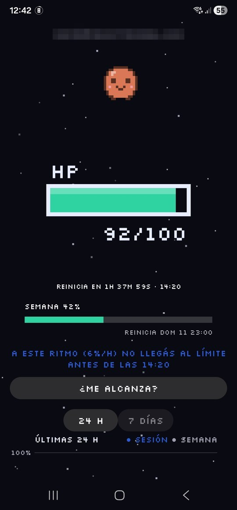
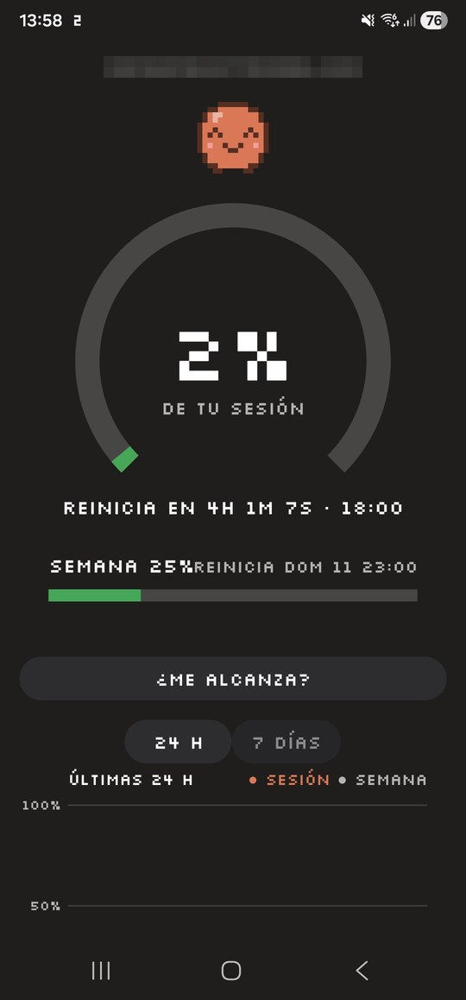
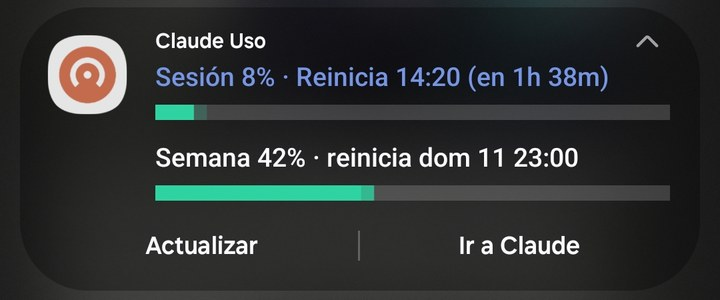
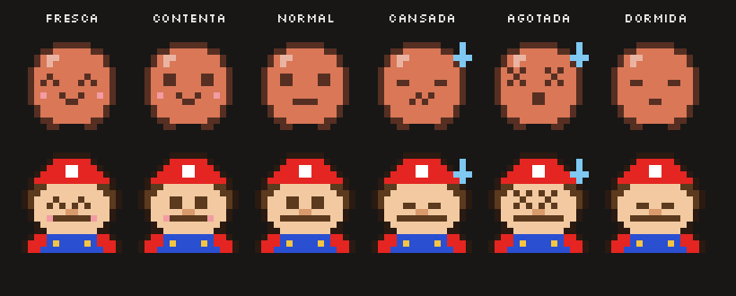
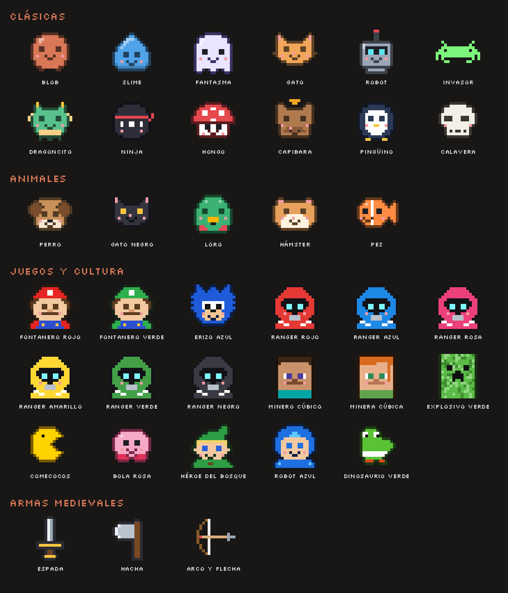

# 📊 Claude Usage Meter for Android

🇪🇸 [Leer en español](README.es.md)

**Your Claude usage, always in sight.** An Android app that shows your current session usage (0–100%) and your weekly usage in real time — in the status bar, in a persistent notification, in an animated home screen widget, and in an app full of stats, pixel-art pets and retro themes. 🎮

> ⚠️ Personal, **unofficial** app. Not affiliated with Anthropic. It reads the same numbers Claude shows in *Settings → Usage* (the 5-hour session and the weekly limit).

🌍 **Available in 7 languages** — Spanish, English, Italian, French, German, Japanese and Chinese. The app follows your phone's language automatically; any other language falls back to Spanish.

<p align="center">
  
  &nbsp;
  
</p>

<p align="center">
  
</p>

---

## 📲 Install

1. ⬇️ Download the `.apk` from the **[latest release](../../releases/latest)**.
2. 📂 Open it on your phone and allow installing apps from unknown sources.
3. 🔑 Sign in to Claude inside the app. That's it — the app sets itself up.

📱 Requires **Android 8 or later**. Tested on a Samsung Galaxy S22 Ultra (One UI).
🔄 To update, install the new APK over the old one: your history and settings are kept.

---

## ✨ What it does

### 🔔 Status bar & notification
- 🔢 Your session percentage lives in the status bar, next to the clock. Android paints those icons in a single color, so you choose a **shape** that stands out: big number, framed number, or a number inside a progress ring.
- 📋 A persistent notification shows session %, reset time and countdown, weekly % with its reset day, and two progress bars — colored with your palette and adjusted to stay readable in light and dark mode.
- 🖼️ The notification image can be your pet, your widget style, or just the app icon.
- 🔘 Up to 3 buttons: **Refresh**, **Open Claude**, **Claude Code**, **See usage on Claude**.
- ⚡ A **Quick Settings tile** shows the percentage and refreshes on tap.
- 🔒 On the lock screen the full notification is visible, and the number shows on the Always On Display.

### 🧩 Home screen widget
- 📐 Resizable from **1×1 to 5×5**, with a different layout for every size — from a single ring up to a full dashboard with bars and a 24-hour chart.
- 🎨 **7 styles**: ring, bar, number only, retro battery, hearts, dot and pet.
- 🎞️ Animated up to your screen's refresh rate (24 to 165 FPS, or automatic). If your launcher can't take that many frames, the app steps down on its own.
- 🌫️ Background opacity, minimal mode (image only at any size), and tap to refresh or open the app.
- 🔐 Can be placed on the lock screen if your One UI version allows it.

### 👾 Pets
- 🐾 **37 pixel-art pets** in 4 categories: **Classics** (blob, slime, ghost, cat, robot, invader, dragon, ninja, mushroom, capybara, penguin, skull), **Animals** (dog, black cat, parrot, hamster, fish), **Games & culture** (original characters inspired by gaming classics: red and green plumbers, blue hedgehog, six rangers, blocky miners, green exploder, dot muncher, pink puffball, forest hero, blue robot, green dinosaur) and **Medieval weapons** (sword, axe, bow and arrow).
- 😄 They react to your usage: they celebrate when the session is fresh, get tired and sweat from 75%, shake with X eyes from 90%, and fall asleep with floating "Zzz" at 100%.
- 👆 Animated at your screen's refresh rate. Tap them and they jump, play a sound and throw pixel hearts.
- 🍼 Optional **chibi** (baby) style and a **different pet every day**.
- 🏠 The app icon can become your pet.

<p align="center">
  
</p>

<details>
<summary>👀 See all 37 pets</summary>
<p align="center"></p>
</details>

### 📈 Stats
- 📉 **24-hour and 7-day charts** for session and week. Touch and drag to see the exact value at any point.
- 🔥 Daily summary (peak, sessions used, limits hit), streak without hitting the limit, busiest hours, and a **comparison with last week**.
- 🗓️ **Heatmap** of when you use Claude (day of week × hour, last 4 weeks).
- 🔮 **Prediction**: "At this pace (12%/h) you'll hit the limit at 16:40".
- 🤔 **Will it last?** — estimates whether your session lasts 30 minutes, 1 hour or 2 hours more at your current pace.
- 🏆 **Achievements**: only the ones you earned are shown; the rest stay hidden in a collapsible list.

### ⏰ Alerts
- 🚨 At **75%, 90% and 100%**, **5 minutes before the reset**, and **when the session resets**.
- 🎵 8-bit sounds (coin, warning, game over, fanfare) and 📳 **patterned vibrations** so you know what happened without looking.
- 😴 **Smart Do Not Disturb**: learns your sleep hours from your history and silences alerts then.
- 📅 **Weekly summary** every Monday.
- 🔐 **Session expired** alert with a button to sign in again.
- ⌚ Alerts reach your Galaxy Watch if notifications are enabled for the app.

### 🤖 Modes & automation
- 🎯 **"Claude Focus" mode**: turns on Do Not Disturb when you hit 90% or 100%, and turns it off by itself when the session resets. It shows up next to your other modes, so Samsung *Modes and Routines* can react to it.
- 🔗 **Events for Tasker, MacroDroid and similar**: action `com.matias.claudeusage.EVENT`, extra `event` = `level75`, `level90`, `limit` or `reset` (plus `pct`).
- 📌 **App shortcuts** (long-press the icon): Refresh, See 7 days, Open Claude, Claude Code.
- 🗣️ "Hey Google, open Claude Uso" opens the app.

### 🔋 Battery & data
- 🧠 **Smart interval**: every 30 s while you use Claude, every 2 min when idle, every 10 min with the screen off. Refreshes instantly when you turn the screen on or get back online.
- 🪫 **Automatic saver mode** below 20% battery or with power saving on: 30 FPS cap, no animated background, still widget.
- 👥 **Multiple Claude accounts**, each with its own history.
- 💾 **Export history to CSV**, manual **backup and restore**, and an **automatic weekly backup** to a folder you pick (keeps the last 4).

---

## ⚙️ Settings reference

Every option, section by section. Lists open and close with the round button on the right, and the screen stays where you were after each change.

| Section | Options |
| --- | --- |
| 👤 **Account** | Switch between accounts · Add another account · Sign in again · Remove an account (and its history) |
| 🌗 **Theme** | System / Light / Dark · Pure AMOLED black in dark mode |
| 🎨 **Appearance** | **Palette** (24, by category: Basics — Claude, Monochrome, Pastel, Neon · Nintendo — Game Boy, Game Boy Advance, NES, DS, Switch, Switch 2, GameCube · PlayStation — PS1 to PS5, PSP, PS Vita · PC & handhelds — gaming PC RGB, retro DOS PC, Steam Deck, ROG Ally, Legion Go, MSI Claw) · **Font** (10: Normal, Pixel, Retro arcade, Terminal, Modern, Square, Rounded, Comic, Monospace, Bold arcade) · **App meter** (12: Arc, Retro battery, Hearts, Pet, RPG health bar, Experience bar, Falling blocks, Dot muncher, Rings, Coins, Speedometer, Fuel) · Zen mode (just the number and time) · **Animated background** (11: Stars, Rain, Snow, Rainbow cat, Falling code, Hyperspace, Bubbles, Fireflies, Fireworks, Hearts, Autumn leaves) · Retro CRT filter · Animated screen transitions |
| 👾 **Pet** | Chibi style · A different pet every day · Choose pet (by category) · Show the pet at the top · App icon = your pet · 8-bit sounds |
| 🏆 **Achievements** | Earned achievements · Hidden list of the ones you can still earn |
| 🔔 **Status bar & notification** | Status bar icon: big number / framed number / number inside a ring · Notification image: your pet / widget style / app icon only · Notification buttons: Refresh, Open Claude, Claude Code, See usage on Claude |
| 🎞️ **Animations** | Animations on/off · **App smoothness**: automatic (your screen's refresh rate) or fixed 24, 30, 48, 60, 90, 120, 144, 165 FPS · Pulse past 90% · Confetti on reset · Seconds in the countdown |
| ⏰ **Updates & alerts** | Smart interval · Alert 5 min before reset · Weekly summary on Mondays · Patterned vibrations · Automatic saver mode · Smart Do Not Disturb (shows your detected sleep hours) · Vibrate when refreshing from the widget or Quick Settings |
| 🤖 **Modes & automation** | "Claude Focus" mode · Turn on at 90% or 100% · Grant Do Not Disturb access · Events for Tasker/MacroDroid |
| 🧩 **Home screen widget** | Background opacity · Widget style (7) · Minimal mode · Animate the widget · **Widget smoothness** (automatic or 24–165 FPS) · Current FPS indicator · On tap: refresh / open the app |
| 💾 **Data** | Export history (CSV for Excel) · Backup (settings + history) · Restore backup · Weekly automatic backup · Choose backup folder · Back up now |
| ℹ️ **Other** | How to use the lock screen widget, shortcuts, Google Assistant, Quick Settings tile, Always On Display and Galaxy Watch · Allow background running · Turn off widget and notification |

---

## 🔒 Privacy

- 📱 Your Claude session is stored **only on your phone**.
- 🌐 The app only talks to claude.ai, to read your usage.
- 🚫 Backups never include your signed-in sessions.

---

## 🛠️ Build

Built without Android Studio or Gradle, using `aapt`, `javac`, `dalvik-exchange`, `zipalign` and `apksigner`:

```bash
sudo apt install openjdk-21-jdk aapt apksigner zipalign dalvik-exchange
curl -o android.jar https://raw.githubusercontent.com/Sable/android-platforms/master/android-34/android.jar
./build.sh android.jar path/to/key.jks password
```

🔑 The signing key is **not** in this repository. Updates must always be signed with the same key to install over the existing app.

## 📁 Project structure

| Folder / file | Contents |
| --- | --- |
| `src/` | ☕ Java source code |
| `src/.../L.java` | 🌍 Translations (7 languages) |
| `res/` | 🖼️ Layouts, icons, 8-bit sounds and launcher strings per language |
| `assets/` | 🔤 Fonts |
| `design/` | 👾 Pet sprites (`mascots.py`), preview (`preview.py`), generator (`gen.py`) and translation sources (`i18n/`) |
| `docs/` | 📸 README screenshots |
| `build.sh` | 🛠️ Build script |

## 🙌 Credits

- 🔤 Fonts under the SIL Open Font License 1.1: [Silkscreen](https://github.com/googlefonts/silkscreen), Press Start 2P, VT323, Orbitron, Fredoka, Comic Neue and Bungee.
- 🎮 The "Games & culture" pets are **original designs** inspired by video game classics. They are not official characters.
